# 🏦 BankService Backend

Spring Boot, React 기반 온라인 뱅킹 서비스 백엔드 API 서버입니다. JWT 인증, 계좌 관리, 계좌이체 기능을 제공합니다.

## ⚙️ 기술 스택

| 분류 | 기술 |
|------|------|
| Framework | Spring Boot 3.5.9, Spring Security |
| Language | Java 21 |
| Database | PostgreSQL, Redis (Refresh Token 저장) |
| ORM | Spring Data JPA (Hibernate) |
| Auth | JWT (Access Token + Refresh Token), Redis 기반 Refresh Token |
| Build | Gradle |
| Frontend | React 18, vite |
| Test | k6 (부하 테스트) |


## 🧑‍💻 팀원 구성

| **서연수** | **성시우** |
| :------: |  :------: |
| [ <br/> @brynn00](https://github.com/brynn00) | [ <br/> @sung0368](https://github.com/sung0368) |


## 🚀 주요 기능

- **🔐 회원 인증**: JWT AccessToken / RefreshToken 기반 인증
- **📝 회원 가입**: 아이디, 비밀번호, 이메일, 이름, 주민등록번호, 전화번호 유효성 검증
- **💳 계좌 개설**: 본인 인증, 계좌 비밀번호(PIN) 설정, 계좌번호 자동 생성
- **💸 계좌 이체**: PIN 인증 후 이체, 실패 횟수 추적 및 계좌 잠금
- **⚡ 동시성 제어**: 비관적 잠금(PESSIMISTIC_WRITE)으로 동시성 제어, 데드락 방지
- **📊 거래 내역 조회**: 월별/전체 내역 조회, N+1 쿼리 최적화(배치 로딩)
- **🛠️ 계좌 관리**: 계좌 개설, 조회, PIN 변경, 해지

## 🗂️ 프로젝트 구조

```
bankservice/
├── src/main/java/com/bankservice/
│   ├── auth/                          # 인증/인가
│   │   ├── AuthController.java        #   로그인, 로그아웃, 토큰 갱신 API
│   │   ├── AuthService.java           #   인증 비즈니스 로직
│   │   ├── JwtProvider.java           #   JWT 생성/검증
│   │   ├── JwtAuthenticationFilter.java  # JWT 인증 필터
│   │   └── dto/                       #   요청/응답 DTO
│   ├── account/                       # 계좌 관리
│   │   ├── AccountController.java     #   계좌 API (개설, 조회, PIN 변경, 해지)
│   │   ├── AccountService.java        #   계좌 비즈니스 로직
│   │   ├── Account.java               #   계좌 엔티티
│   │   ├── AccountRepository.java     #   JPA 레포지토리 (비관적 잠금 포함)
│   │   └── PinVerifier.java           #   PIN 검증 (실패 횟수 제한)
│   ├── transfer/                      # 이체/거래
│   │   ├── TransferController.java    #   이체, 내역 조회 API
│   │   ├── TransferService.java       #   이체 로직 (잠금, N+1 최적화)
│   │   ├── Transaction.java           #   거래 엔티티
│   │   └── AccountHistory.java        #   잔액 변경 이력 엔티티
│   ├── user/                          # 사용자
│   │   ├── UserController.java        #   회원가입 API
│   │   ├── UserService.java           #   회원가입 로직
│   │   ├── User.java                  #   사용자 엔티티
│   │   └── UserProfile.java           #   프로필 엔티티 (주민번호 암호화)
│   ├── config/                        # 설정
│   │   ├── SecurityConfig.java        #   Spring Security + JWT 설정
│   │   ├── GlobalExceptionHandler.java  # 전역 예외 처리
│   │   └── RedisConfig.java           #   Redis 설정
│   └── token/
│       └── RefreshTokenRedisRepository.java  # RT Redis 저장소
│
├── frontend/src/                      # React 프론트엔드
│   ├── api/                           #   Axios 클라이언트 (토큰 자동 갱신)
│   ├── components/                    #   Navbar, PrivateRoute (인증 라우트 가드)
│   └── pages/                         #   로그인, 회원가입, 계좌 개설, 이체, 내역 조회
│
├── db/schema.sql                      # DB 스키마
└── k6/                                # 부하 테스트
```


## 🖥️ 실행 환경

### 📌 필수 요구사항

- Java 17+
- PostgreSQL 14+
- Redis 6+
- Node.js

### 🛢️ 데이터베이스 설정

```bash
# PostgreSQL 데이터베이스 생성
psql -U postgres
CREATE DATABASE bankdb;
CREATE USER bankuser WITH PASSWORD 'bankpass';
GRANT ALL PRIVILEGES ON DATABASE bankdb TO bankuser;

# 스키마 적용
psql -U bankuser -d bankdb -f bankdb.sql
```

### ▶️ 애플리케이션 실행

## 🔧 Backend
```bash
# 빌드
./gradlew build

# 실행
./gradlew bootRun
```

## 🎨 Frontend
```bash
# 파일 이동
cd frontend

# 실행
npm install
npm run dev
```

- Backend: http://localhost:8080
- Frontend: http://localhost:5173

## 📡 API 명세

### 🔐 인증 `/api/auth`

| Method | Endpoint | 설명 |
|--------|----------|------|
| POST | `/api/auth/login` | 로그인 (AccessToken + RefreshToken 발급) |
| POST | `/api/auth/refresh` | AccessToken 갱신 |
| POST | `/api/auth/logout` | 로그아웃 (RefreshToken 무효화) |
| GET | `/api/auth/token/ttl` | RefreshToken 잔여 유효시간 조회 |

### 👤 회원 `/api/users`

| Method | Endpoint | 설명 |
|--------|----------|------|
| POST | `/api/users` | 회원가입 |

### 💳 계좌 `/api/accounts`

| Method | Endpoint | 설명 |
|--------|----------|------|
| GET | `/api/accounts` | 내 계좌 목록 조회 |
| POST | `/api/accounts` | 계좌 개설 |
| PATCH | `/api/accounts/{accountNumber}/pin` | PIN 변경 |
| PATCH | `/api/accounts/{accountNumber}/close` | 계좌 해지 |
| POST | `/api/accounts/verify-identity` | 본인 인증 (이름, 주민번호, 전화번호) |

### 💸 이체 `/api/transfer`

| Method | Endpoint | 설명 |
|--------|----------|------|
| POST | `/api/transfer` | 계좌이체 |
| GET | `/api/transfer/history` | 특정 계좌의 월별 거래내역 |
| GET | `/api/transfer/all-history` | 내 모든 계좌 거래내역 |

## 🔄 인증 흐름

```
로그인 요청
    └── AccessToken (JWT, 10분) → Authorization 헤더
    └── RefreshToken (UUID, 7일) → cookie + Redis 저장

AccessToken 만료 시
    └── /api/auth/refresh 호출 → 새 AccessToken 발급

로그아웃 시
    └── Redis에서 RefreshToken 삭제 → 서버 측 무효화
```

## 보안 고려사항

- PIN은 계좌별 랜덤 Salt + BCrypt로 해싱
- RefreshToken은 httpOnly 쿠키로 전달 (XSS 방지)
- Redis에 RefreshToken 저장으로 서버 측 로그아웃 지원
- Pessimistic Locking으로 동시 이체 시 데이터 정합성 보장
- 주민등록번호는 암호화 저장 (AES)


## 🖼️ 실행 화면

### 홈
로그인 후 메인 화면으로, 주요 메뉴를 확인할 수 있습니다.
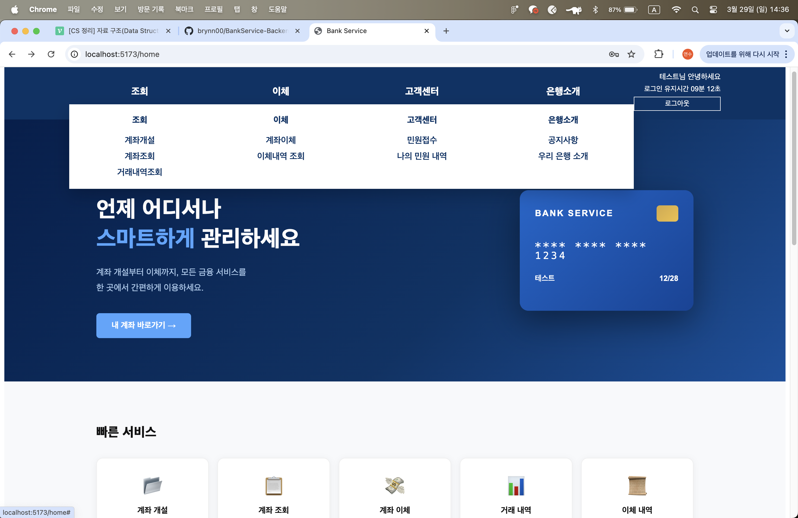

### 회원가입
아이디, 비밀번호, 이메일, 이름, 주민등록번호, 전화번호를 입력하며 각 항목별 유효성 검증이 적용됩니다.
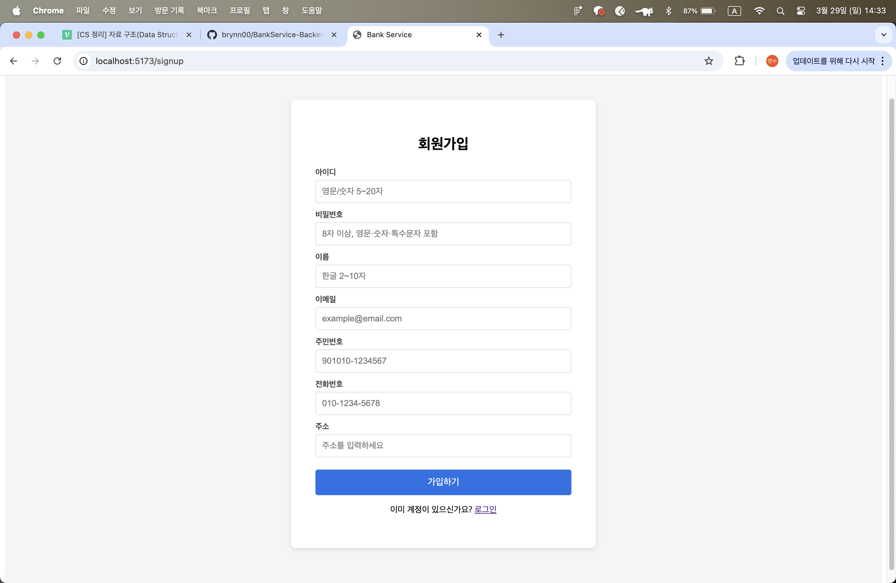

### 계좌 조회
보유 계좌의 계좌번호와 잔액을 조회합니다.
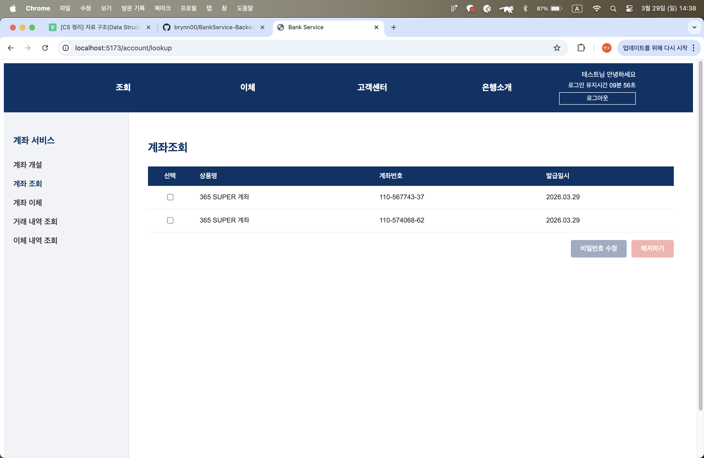

### 계좌 개설
본인 인증 후 약관 동의, 정보 입력, PIN 설정 순서로 진행되며 계좌번호가 자동 발급됩니다.
| 약관 동의 | 정보 입력 | 개설 완료 |
|-----------|-----------|-----------|
| 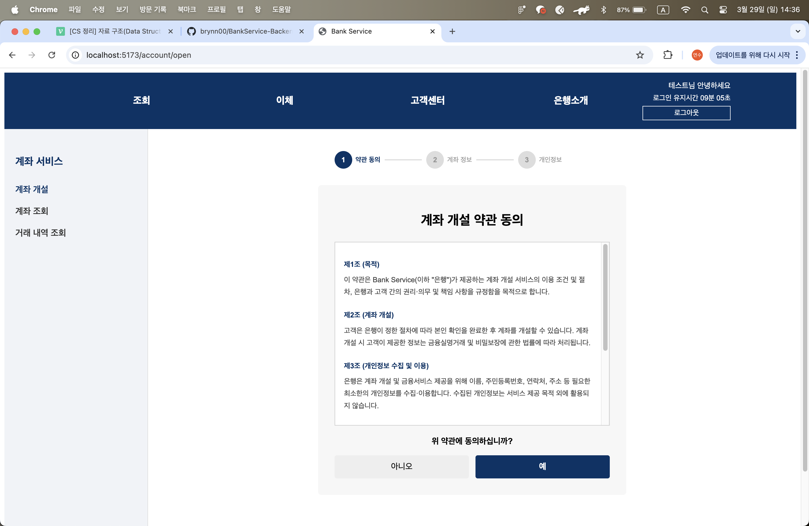 | 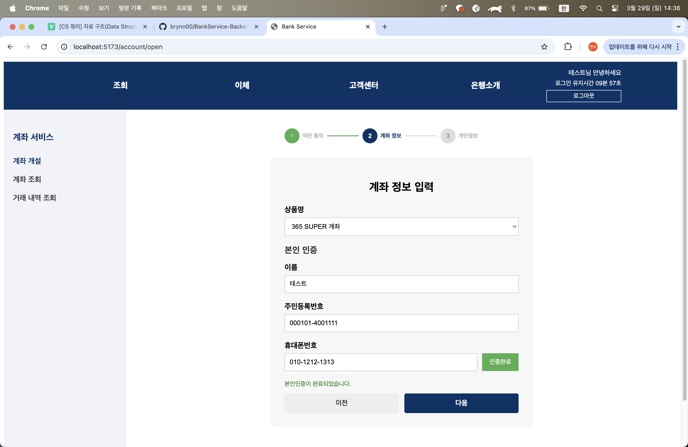 | 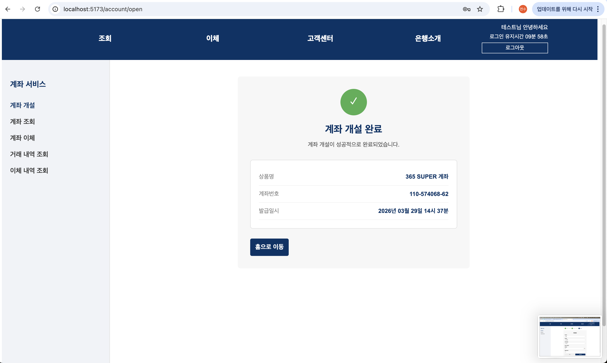 |

### 계좌 이체
출금 계좌, 입금 계좌, 금액, PIN을 입력하여 이체합니다. PIN 5회 오류 시 계좌가 잠깁니다.
| 정보 입력 | 이체 완료 |
|-----------|-----------|
| 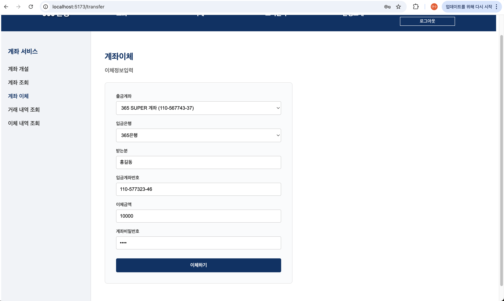 | 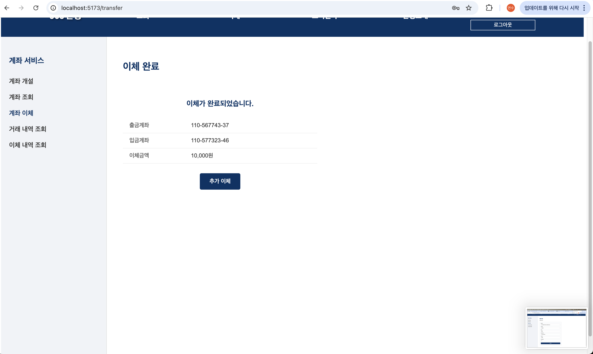 |

### 거래 내역 조회
계좌별 월별 거래 내역을 조회합니다.
| 내역 없음 | 내역 확인 |
|-----------|-----------|
| 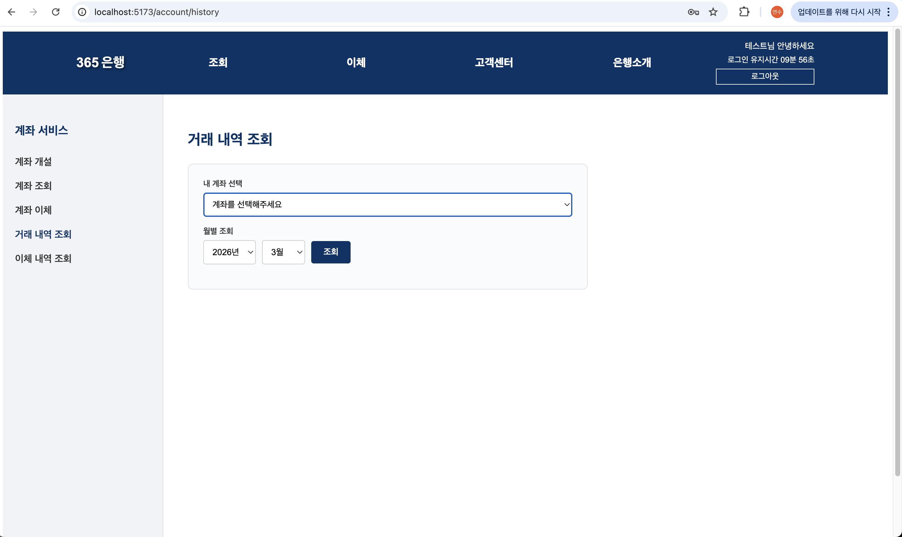 | 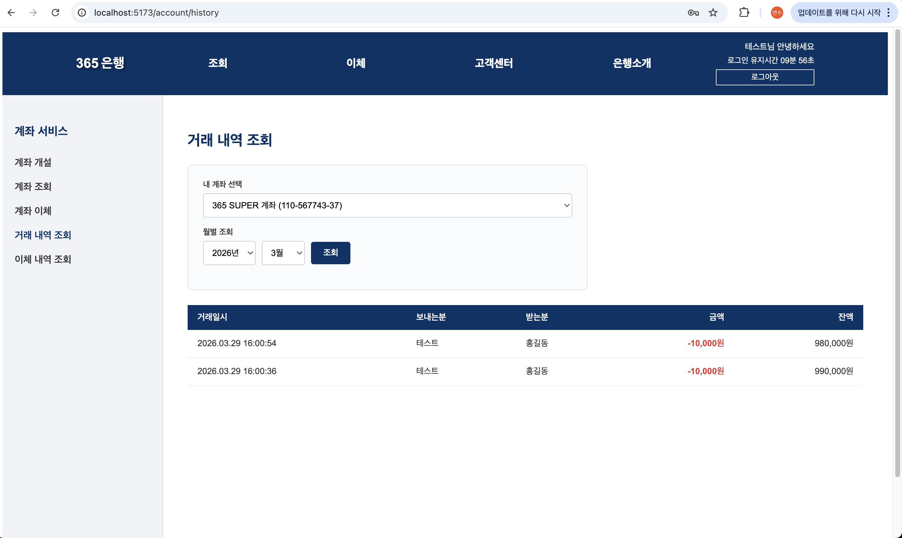 |

### 계좌 비밀번호 수정
현재 PIN 인증 후 새 PIN으로 변경합니다.
| 수정 | 완료 |
|------|------|
| 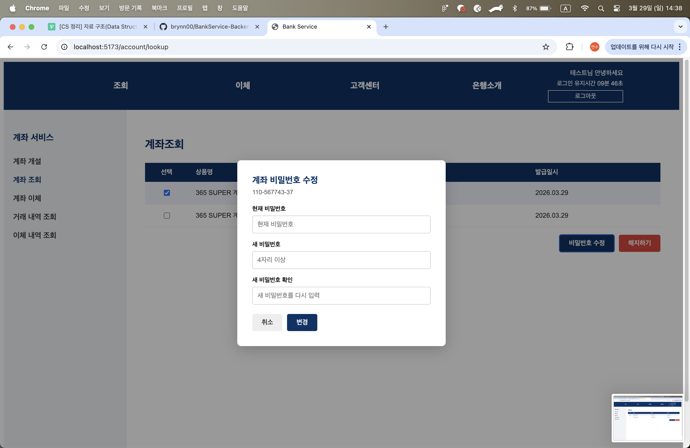 | 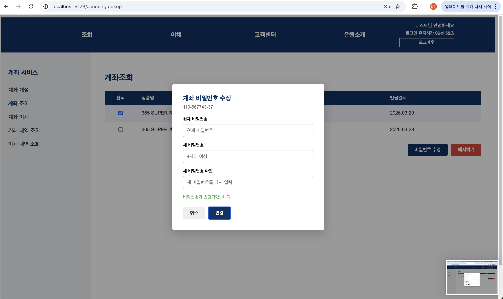 |
